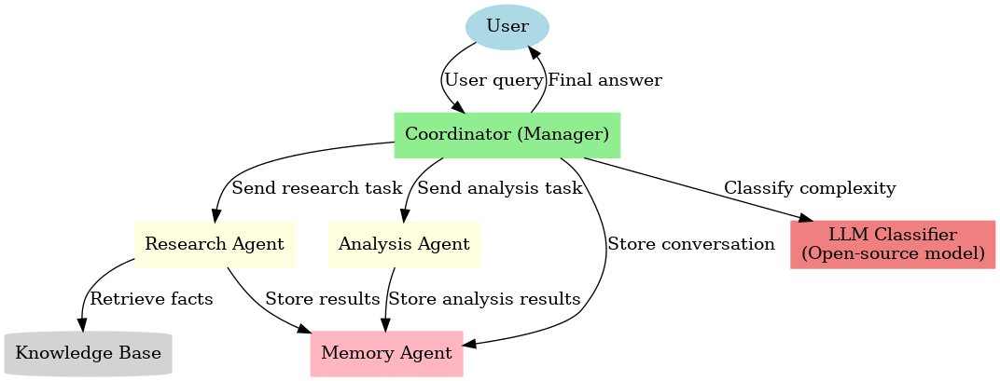

# Simple Multi-Agent Chat System

This project implements a **multi-agent chat system** with:
- A **Coordinator (Manager)** that orchestrates tasks.
- Three worker agents:
  - **ResearchAgent** (retrieves from a mock knowledge base + memory).
  - **AnalysisAgent** (compares/analyzes retrieved data).
  - **MemoryAgent** (stores conversations, facts, and state).
- A structured **memory layer** with vector similarity search (sentence-transformers).
- An **open-source LLM client** (HuggingFace Transformers) for **query complexity classification**.

---

## 📂 Components
- **Coordinator** – Receives queries, classifies complexity, plans agent execution, synthesizes results.
- **ResearchAgent** – Retrieves knowledge items from KB + memory.
- **AnalysisAgent** – Performs comparisons and reasoning.
- **MemoryAgent** – Stores history, knowledge, and agent states.
- **LLMClient** – Uses HuggingFace pipeline to classify query complexity (simple/medium/complex).

---

## ▶️ Project Structure

multi-agent-chat-system/
├── agents/
│ ├── init.py
│ ├── coordinator.py
│ ├── research_agent.py
│ ├── analysis_agent.py
│ └── memory_agent.py
├── memory/
│ ├── init.py
│ ├── vector_memory.py
│ └── metadata_store.py
├── utils/
│ ├── init.py
│ ├── logger.py
│ └── helpers.py
├── tests/
│ ├── init.py
│ └── test_scenarios.py
├── outputs/
│ ├── simple_query.txt
│ ├── complex_query.txt
│ ├── memory_test.txt
│ ├── multi_step.txt
│ └── collaborative.txt
├── main.py
├── requirements.txt
├── Dockerfile
├── docker-compose.yml
└── README.md

---

## 🚀 Running Locally

```
git clone https://github.com/hafeezug/multi_agent_system
cd multi_agent_chat
python -m venv venv
source venv/bin/activate
pip install -r requirements.txt
python -m app.run_console
```

Outputs for the five scenarios will be saved in `outputs/`.

---

## 🐳 Running with Docker

```
docker-compose build
docker-compose up
```

---

## 📂 Outputs
- `outputs/simple_query.txt`
- `outputs/complex_query.txt`
- `outputs/memory_test.txt`
- `outputs/multi_step.txt`
- `outputs/collaborative.txt`
- `outputs/memory_trace.json`

---

## 📊 Memory Design
- **Conversation Memory**: Full history with timestamps.
- **Knowledge Base**: Facts from KB and agent discoveries.
- **Agent State Memory**: Records of what each agent did.
- **Vector Search**: Semantic retrieval using sentence-transformers.

---
